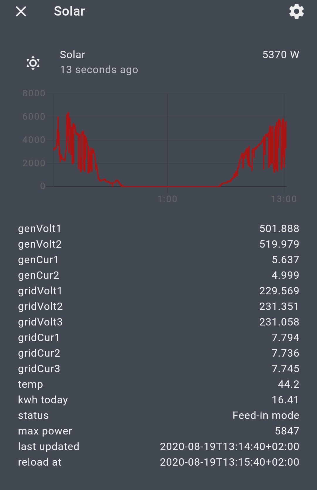

# Kaco

Adds a sensor to Home Assistant that displays several information of a Kaco / Schueco SGI-9k or similar

**This component will set up the following platforms.**

| Platform | Description                           |
| -------- | ------------------------------------- |
| `sensor` | Show date and remaining days to event |




## Features

- Shows all values from the webinterface
- Status is parsed and shown as text
- Tracks maximal seen power
- Configurable update interval

# Installation

## HACS
The easiest way to add this to your Homeassistant installation is using [HACS].

It's recommended to restart Homeassistent directly after the installation without any change to the Configuration.
Homeassistent will install the dependencies during the next reboot. After that you can add and check the configuration without error messages.
This is nothing special to this Integration but the same for all custom components.

## Manual

1. Using the tool of choice open the directory (folder) for your HA configuration (where you find `configuration.yaml`).
2. If you do not have a `custom_components` directory (folder) there, you need to create it.
3. In the `custom_components` directory (folder) create a new folder called `kaco`.
4. Download _all_ the files from the `custom_components/kaco/` directory (folder) in this repository.
5. Place the files you downloaded in the new directory (folder) you created.
6. Follow the instructions under [Configuration](#Configuration) below.

Using your HA configuration directory (folder) as a starting point you should now also have this:

```text
custom_components/kaco/translations/en.json
custom_components/kaco/__init__.py
custom_components/kaco/manifest.json
custom_components/kaco/sensor.py
custom_components/kaco/config_flow.py
custom_components/kaco/const.py

```

# Setup

All you need to have the ip adress of the inverter. This is show on the actual device display.

## Configuration options

| Key                 | Type     | Required | Default | Description                                                                                     |
| ------------------- | -------- | -------- | ------- | ----------------------------------------------------------------------------------------------- |
| `url`               | `string` | `true`   | `None`  | The IP of the inverter, e.g. 192.168.2.194                                                      |
| `name`              | `string` | `false`  | `kaco`  | The friendly name of the sensor                                                                 |
| `kwh_interval`      | `int`    | `false`  | `120`   | The interval of the kwh update                                                                  |
| `interval`          | `int`    | `false`  | `20`    | The interval of all other updates (my inverter crashes if I set it below 5 for more than a day) |
| `generator_voltage` | `bool`  | `false`  | `false` | Import generator voltage as entity                                                              |
| `generator_current` | `bool`  | `false`  | `false` | Import generator current as entity                                                              |
| `grid_voltage`      | `bool`  | `false`  | `false` | Import grid voltage as entity                                                              |
| `grid_current`      | `bool`  | `false`  | `false` | Import grid current as entity                                                              |

## GUI configuration (recommended)

Config flow is supported and is the prefered way to setup the integration. (No need to restart Home-Assistant)

## Manual configuration

To enable the sensor, add the following lines to your `configuration.yaml` file and replace the link accordingly:

```yaml
# Example entry for configuration.yaml
sensor:
  - platform: kaco
    name: Solar Power
    url: 192.168.2.194
 ```
 However grouping via devices are not supported if you using configuration via yaml